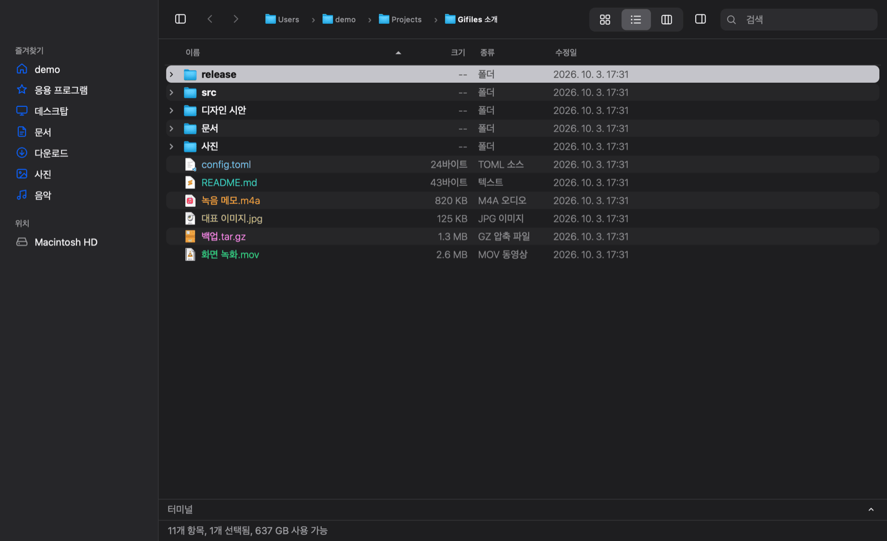
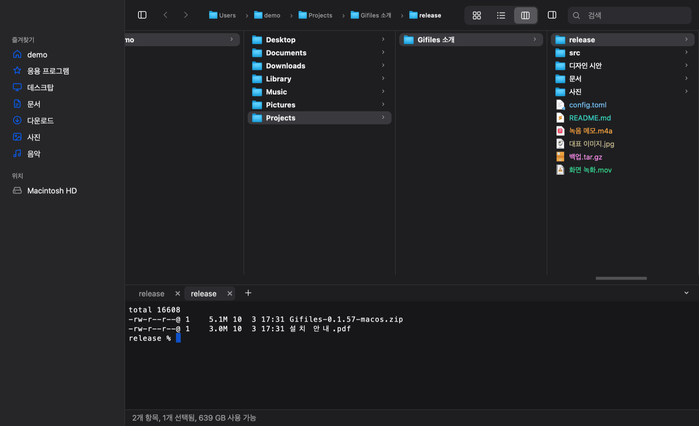
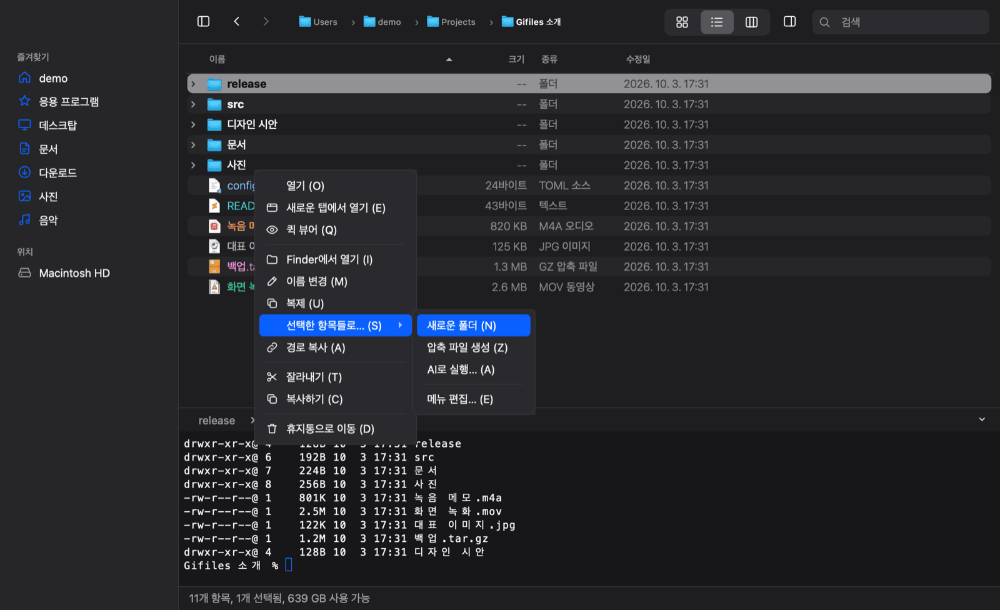
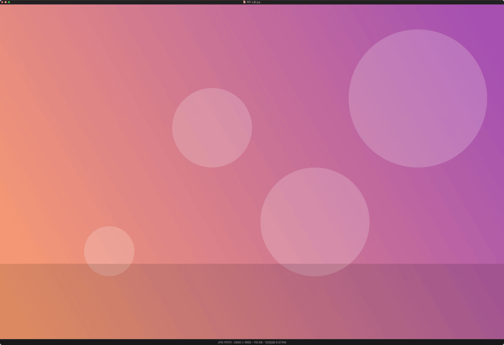
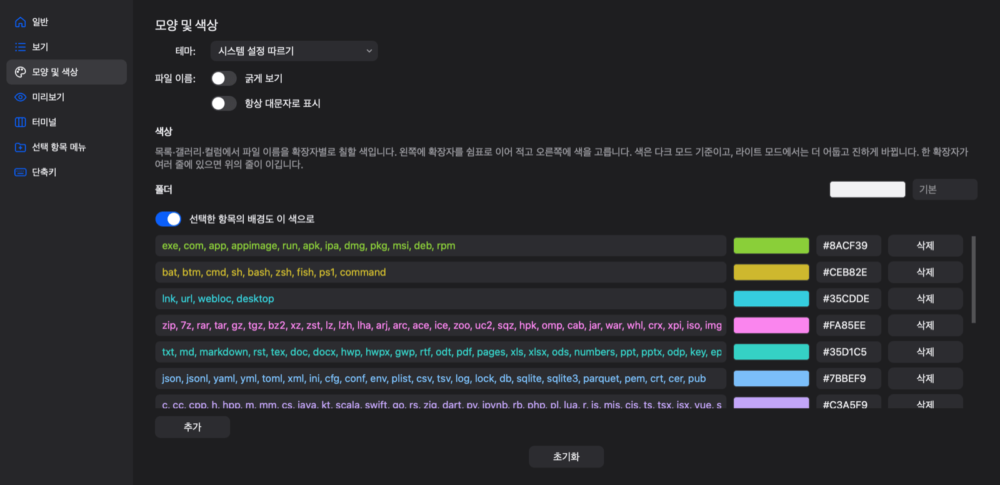
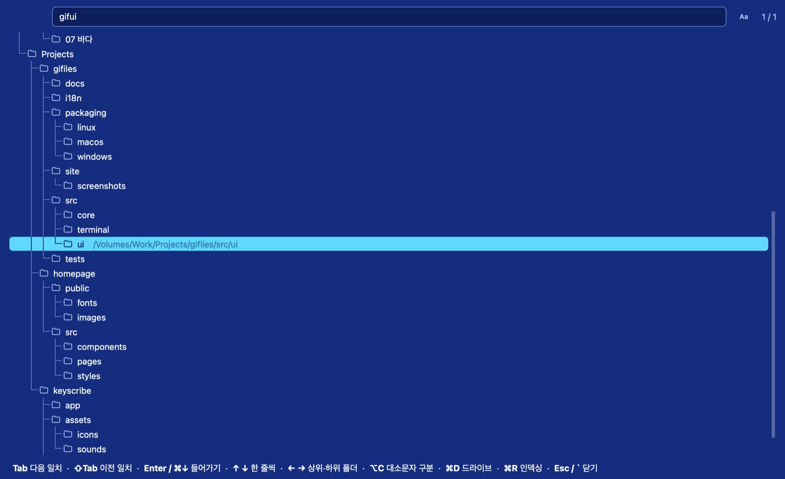
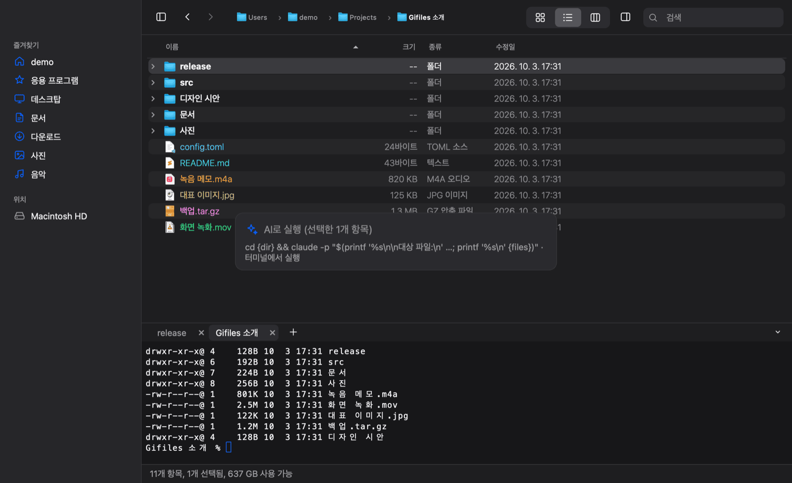

# Gifiles

macOS Finder의 사용감을 그대로 옮긴 크로스 플랫폼(macOS·Windows·Linux) 파일 관리자. Qt 6 Widgets(C++20).

> 개인이 만들어 무료로 공개하는 앱입니다. 자유롭게 쓰셔도 되지만 기능 제안, 버그 신고, 사용 지원은 받지 않습니다. 원하는 기능이 있으면 MIT 라이선스에 따라 포크해서 고쳐 쓰세요.
>
> A personal app, shared for free. You're welcome to use it, but feature requests, bug reports and support requests aren't accepted. If you want a feature, fork it and change it under the MIT license.
>
> 個人が作って無料で公開しているアプリです。自由に使っていただいて構いませんが、機能の提案・バグ報告・使い方のサポートは受け付けていません。欲しい機能があれば、MIT ライセンスに従ってフォークして改造してください。
>
> 这是个人制作并免费公开的应用。欢迎自由使用，但不接受功能建议、错误报告或使用支持。如需某项功能，请按照 MIT 许可证 fork 后自行修改。

**[다운로드 · 소개 페이지](https://files.gitools.net)** · [최신 릴리스](https://github.com/zidell/gifiles/releases/latest)



| 터미널 연동 | 선택한 항목들로… (사용자 메뉴) |
| --- | --- |
|  |  |
| **퀵 뷰어** | **확장자별 색상 설정** |
|  |  |
| **폴더 트리 (\`, NCD 스타일)** | **AI 연동** |
|  |  |

## 빌드·실행

```sh
# macOS (Homebrew)
brew install qt cmake ninja
cmake -S . -B build-rel -G Ninja -DCMAKE_BUILD_TYPE=Release -DCMAKE_PREFIX_PATH=$(brew --prefix qt) -DGIFILES_BUNDLED_VTERM=ON
cmake --build build-rel
open build-rel/Gifiles.app                 # 지난번 창·탭 복원
build-rel/Gifiles.app/Contents/MacOS/Gifiles ~/Downloads   # 특정 폴더로 열기
```

### macOS 폴더 권한

macOS는 데스크탑·문서·다운로드·외장/네트워크 볼륨을 폴더마다 따로 허용받는다. 매번 묻지 않게 하려면:

1. **서명 인증서로 빌드한다.** 링커 기본 서명(ad-hoc)은 빌드할 때마다 달라져서, macOS가 새 앱으로 보고 권한을 다시 묻는다.
   `security find-identity -v -p codesigning`으로 인증서를 찾아 configure할 때 넘긴다.
   ```sh
   cmake -S . -B build-rel -DGIFILES_SIGN_IDENTITY=<SHA-1 또는 인증서 이름>
   ```
2. **시스템 설정 → 개인정보 보호 및 보안 → 전체 디스크 접근 권한**에 `Gifiles.app`을 한 번 추가한다.
   서명이 고정돼 있으면 이후 다시 빌드해도 유지된다.

Windows/Linux도 같은 CMake 명령에 각 환경의 Qt 경로(`CMAKE_PREFIX_PATH`)만 바꾸면 된다.
필요한 Qt 모듈: Widgets, Concurrent, Multimedia, MultimediaWidgets, Svg (+ 있으면 Pdf, PdfWidgets).
터미널 패널의 libvterm은 크기 변경 오류를 수정한 포함 소스로 함께 빌드하므로 별도 설치가 필요 없다.

## 단축키

기본 동작은 맥 기준이며 ⌘는 Windows·Linux에서 Ctrl에 대응한다. Windows도 Finder와 같이 Enter는 이름 변경, ⌘↓(Ctrl+↓)는 열기다.
메뉴뿐 아니라 파일뷰·퀵 뷰어·터미널·사이드바·검색·경로 입력·이름 편집·컨텍스트 메뉴의 앱 기능키도 설정 → 단축키에서 변경할 수 있다.
같은 영역에서 겹치는 키만 다른 기능에서 빠지며, 서로 다른 영역은 같은 키를 사용할 수 있다.

아래 ⌘는 Windows/Linux에서 Ctrl이다. 메뉴에도 모두 표시된다. 메뉴 항목의 단축키는 설정(⌘,) → 단축키에서
'재지정'을 누르면 뜨는 작은 창에서 새 키를 누르고 확인한다(Return·Esc도 단축키로 쓸 수 있어 버튼으로만 닫힌다.
다른 기능에 이미 할당된 키면 빨간 글씨로 알려 주고, 확인하면 그쪽에서 빠진다). 목록 아래의 초기화(모든 키를 기본값으로)·
전부 제거(모든 키 지움)는 한 번 더 묻고 적용한다.
컨텍스트 메뉴의 항목에는 "열기 (O)"처럼 글자가 붙어 있어, 메뉴가 열린 채 그 글자를 누르면 바로 실행된다(한글 자판 그대로 가능,
"선택한 항목들로… (S)"는 하위 메뉴를 연다). 글자의 기본값은 Windows 관례를 따른다: 열기 O, 다음으로 열기 H, 새 탭 E,
퀵 뷰어 Q, Finder에서 열기 I, 이름 변경 M, 복제 U, 경로 복사 A, 잘라내기 T, 복사 C, 휴지통 D, 새 폴더 F, 붙여넣기 P,
여기로 이동 M, 보기 1·2·3, 숨김 파일 H.

| 동작 | 키 |
|---|---|
| 새 윈도우 / 새 탭 / 탭 닫기 / 윈도우 닫기 | ⌘N / ⌘T / ⌘W / ⇧⌘W |
| 설정 | ⌘, |
| 터미널 패널 접기/펼치기 | ⌃\` (Windows/Linux: Ctrl+\`) |
| 선택 항목으로 새로운 폴더 (되돌리기 가능) | ⌃⌘N (Windows/Linux: Ctrl+Alt+N) |
| 목록에서 폴더 펼치기 / 접기 (⌥: 하위까지) · 더 접을 게 없으면 사이드바로 (사이드바에서 →는 목록으로) | → / ← |
| 다음·이전 탭 | ⌃⇥ / ⌃⇧⇥ · ⇧⌘] / ⇧⌘[ (Windows: Ctrl+Tab, Ctrl+PgDn/PgUp) |
| 보기: 갤러리 / 목록 / 컬럼 (Finder와 같은 순서) | ⌘1 / ⌘2 / ⌘3 |
| 퀵 뷰어 (열린 채 ↑↓←→로 다음 항목, Enter 재생/일시정지, 소리·영상은 ←→ 5초 뒤로/앞으로, 진행 바 클릭 위치로 이동, 방금 재생하던 파일은 다시 열면 멈춘 곳부터 — 끝까지 봤거나 폴더를 옮기면 처음부터) | Space · ⌘Y |
| 미리보기 패널 | ⇧⌘P |
| 이름 변경 (확장자 앞까지 선택된 채 시작) | Enter |
| 열기 / 새로운 탭에서 열기 (폴더만, 파일을 골랐으면 열기 키는 컨텍스트 메뉴를 띄운다: 첫 항목 열기에서 Return) | ⌘↓ · 더블클릭 / ⌃⌘O · ⌘+더블클릭 |
| 뷰 이동 (접힌 영역은 펼침) | Alt+← 사이드바 · Alt+→/↑ 파일뷰 · Alt+↓ 터미널 |
| 상위 폴더 / 뒤로 / 앞으로 | ⌘↑ / ⌘[ · ⌘← / ⌘] · ⌘→ |
| 범위 선택 / 토글 선택 / 전체 선택 | Shift+클릭·Shift+방향키 / ⌘+클릭 / ⌘A |
| 이름으로 찾아가기 | 글자 입력 |
| 복사 / 잘라내기 / 붙여넣기 / 여기로 이동 | ⌘C / ⌘X / ⌘V / ⌥⌘V — Mac식(복사 후 ⌥⌘V로 이동)과 Windows식(잘라내기 후 붙여넣기) 모두 |
| 복제 / 휴지통으로 / 새 폴더 | ⌘D / ⌘⌫ · Delete / ⇧⌘N |
| 실행 취소 / 실행 복귀 (이름 변경·이동·복사·휴지통·새 폴더) | ⌘Z / ⇧⌘Z |
| 정보 가져오기 / 경로 복사 | ⌘I / ⌥⌘C |
| 검색(현재 폴더 이름 필터) | ⌘F (Esc 해제, ↓ 목록으로) |
| 폴더로 이동 (Tab 자동 완성) | ⇧⌘G · 경로 막대 빈 곳 클릭 |
| 폴더 트리 (드라이브 전체, 아래 참고) | \` (₩) · 이동 메뉴 |
| 홈 / 데스크탑 / 문서 / 다운로드 / 응용 프로그램 | ⇧⌘H / ⇧⌘D / ⇧⌘O / ⌥⌘L / ⇧⌘A |
| 숨김 파일 / 사이드바 | ⇧⌘. / ⌃⌘S |
| 글자 크기 (목록·갤러리·컬럼) / 기본 크기 | ⌘+ / ⌘− / ⌘0 |
| 갤러리 아이콘 크기 | ⌥⌘+ / ⌥⌘− · 상태 막대 슬라이더 |

## 폴더 트리

옛 노턴 유틸리티의 NCD처럼 드라이브의 모든 폴더를 트리로 띄워 찾아간다. 파일 목록이나 사이드바에서 \`(한글 자판에서는 ₩)를
누르면 창 전체를 덮는 NCD 같은 파란 화면(흰 글씨, 하늘색 커서 막대)에 트리가 열리고, 지금 폴더에 커서가 있다. 트리는 접히지 않고 늘 전부 펼쳐져 있다(트리 선으로 구조 표시).

- 폴더 경로의 글자를 차례로 치면 치는 대로 가장 잘 맞는 폴더로 커서가 간다. 각 폴더의 전체 경로를 슬래시 없이 한 줄로 보고
  친 글자가 그 순서대로 들어 있으면 일치한다(`sigif` → `Sites/gifiles`). 순서는 이름이 그대로 같음 > 이름 앞부분 > 이름 안에
  붙어서 > 이름 안에 차례로 > 경로를 거쳐 이 폴더 이름에서 끝남 > 일치한 폴더의 하위 폴더, 같으면 지금 폴더에서 트리상 가까운 폴더,
  자주 간 폴더, 얕은 폴더 순.
  한글은 조합 중인 글자도 바로 찾는다. 오른쪽 `Aa`(⌥C)는 대소문자 구분(config.toml `folder_tree.case_sensitive`).
- Tab / ⇧Tab 다음·이전 일치, ↑↓ 한 줄씩, ← 상위 폴더 · → 첫 하위 폴더, PgUp/PgDn·Home/End, Enter·⌘↓(또는 더블클릭)로
  그 폴더로 이동, ⌘D 드라이브 목록(↑↓·글자로 고르고 Enter, 고른 드라이브만 트리로 보여 주고 처음이면 그 자리에서 인덱싱, 앱을 끌 때까지 유지), ⌘R 인덱싱(트리 가운데 "인덱싱 중…"), Esc나 \`로 닫기. 고른 줄에는 이름 오른쪽에 전체 경로가 흐리게 보이고, 아래쪽에 이 키들이 나온다(트리 안의 키는 고정, 여는 \`만 설정 → 단축키에서 바꿀 수 있다).
- 폴더 목록은 백그라운드에서 만들어 캐시에 두고, 알아서 최신으로 유지한다(이 맥에서 폴더 약 11만 개, 릴리스 빌드로 처음 스캔 8.3초,
  캐시 5MB, 불러오기 1ms 미만, 검색 한 번 1~2ms). macOS는 시스템의 변경 기록(FSEvents)을 따라가 바뀐 폴더만 다시 읽는다(0.2초 안팎):
  트리가 열려 있으면 바로, 앱이 꺼져 있던 동안 바뀐 것도 다음에 켜면 반영된다. 기록이 끊겼거나 너무 오래 밀렸을 때만 전체를 다시 읽는다.
  Windows·Linux는 앱을 켜고 20초 뒤와 이후 한 시간마다 6시간이 넘었으면 다시 읽고, 트리를 열 때 30분이 넘었거나 앱에서 폴더를 바꿨거나
  지금 폴더가 그 뒤에 바뀌었으면 옛 목록을 먼저 보여 주고 뒤에서 새로 읽는다. ⌘R은 그래도 이상할 때 쓰는 수동 인덱싱. 트리를 닫고 2분 뒤 메모리에서 내린다.
- 범위는 config.toml `[folder_tree]`: `roots`(기본은 드라이브 전체, Windows는 모든 고정 드라이브)와 `exclude`(이름 또는 경로,
  `*` `?` 가능). 네트워크·FUSE 드라이브는 자동으로 빠지고, 기본으로 `node_modules`·`.git`, macOS의 `/System`·`/Volumes`·
  `~/Library`·`.app` 같은 패키지 안이 빠진다. macOS에서 전체 디스크 접근 권한이 없으면 데스크탑·문서·다운로드는 앱에서 한 번
  열어 본 뒤부터 들어간다(백그라운드 스캔이 권한 창을 띄우지 않도록).

## 터미널 연동

목록 아래 터미널 패널은 목록과 서로 맞물린다. 패널 막대는 항상 아래에 남아 있고, 막대나 화살표를 누르거나 ⌃\`로 터미널을 접고 펼친다(펼친 높이는 위 경계를 끌어 조절).

- 폴더를 옮기면 지금 보이는 터미널 탭이 `cd` 한다. 그 탭에서 프로그램이 실행 중이면 그 탭은 그대로 두고 새 탭을 그 폴더에서 연다.
  입력 중인 줄만 있으면(예: `rm -rf ` 입력 후 파일을 찾으러 폴더 이동) 새 탭을 열지 않고, 줄을 실행하거나 지울 때까지 기다린다.
- 터미널 탭: 패널 막대에 크롬처럼 탭이 붙는다. `+`로 추가, ×로 닫기, 끌어서 순서 변경. 터미널에 포커스가 있을 때
  ⌘T 새 탭 · ⌘W 탭 닫기 · ⌃Tab / ⇧⌘] 다음 탭(Windows/Linux: Ctrl+T · Ctrl+W · Ctrl+Tab).
  탭을 바꾸면 목록이 그 셸의 폴더로 간다. 탭 이름은 프로그램이 정한 제목, 없으면 폴더 이름.
- 목록에서 고른 항목을 터미널로 끌어다 놓으면 전체 경로가 따옴표로 입력줄에 붙는다(예: `rm -rf ` 입력 → 파일 끌어다 놓기 → Enter). 파일은 옮겨지지 않는다.
- 터미널에서 `cd` 하면 목록도 따라간다.
- Alt+방향키는 터미널에서도 뷰 이동에 사용한다. Alt+←/→의 셸 단어 이동보다 우선하며, 설정 → 단축키에서 변경할 수 있다.
- 셸: macOS/Linux는 로그인 셸($SHELL), Windows는 PowerShell. 설정에서 바꾸거나 각 연동을 끌 수 있다.

- 사이드바와 파일뷰를 오갈 때 마지막 포커스 항목을 유지한다. 사이드바 선택색은 현재 열린 폴더에만 표시하고, 다른 항목의 키보드 포커스는 옅은 배경으로 표시한다.

## AI 요청

파일을 고르고 컨텍스트 메뉴(⌘↓) → 선택한 항목들로… → AI로 실행(A)을 고르면 창 가운데에 한 줄 입력창이 뜬다.
요청을 적고 Enter를 치면 터미널 패널이 펼쳐지고 `claude -p '요청 + 대상 파일 경로'`가 그 폴더에서 실행된다.

- 도구를 바꾸려면 설정(⌘,) → 선택 항목 메뉴에서 "AI로 실행"의 명령을 고친다(예: `codex exec {prompt}`).
- 터미널에서 다른 프로그램이 실행 중이면 새 터미널 탭에서 실행하고, 입력 중인 줄이 있으면 끝날 때까지 기다렸다가 실행한다.

## 폴더별 보기 기억

보기 모드, 정렬, 열 너비·순서, 갤러리 아이콘 크기를 바꾸면 그 폴더에 기억했다가 다음에 그대로 연다.

## 마우스·드래그

- 목록: 이름 위에서 끌면 파일 이동, 빈 곳(다른 열·행 여백·아래)에서 끌면 영역 선택. 갤러리도 빈 곳에서 영역 선택
- 항목을 끌어 폴더·다른 창·Finder/탐색기로 이동/복사
- 사이드바: 항목 사이에 놓으면 그 자리에 즐겨찾기 추가(파일도 가능), 폴더 항목 가운데에 놓으면 그 폴더로 이동/복사, 즐겨찾기끼리 끌어서 순서 변경
- 우클릭 → "Finder에서 열기"(Windows: 탐색기에서 열기, Linux: 파일 관리자에서 열기): 폴더는 그 폴더를, 파일은 들어 있는 폴더를 그 파일이 선택된 채로 연다. 빈 곳에서 누르면 현재 폴더. 정보 가져오기는 파일 메뉴(⌘I)에 있다
- 우클릭 → "다음으로 열기…": 앱 목록에서 고르고 "항상 이 앱으로 .확장자 파일 열기" 선택(Gifiles에서 열 때 적용). Windows는 시스템 연결 프로그램 창
- 같은 볼륨이면 이동, 다른 볼륨이면 복사. macOS: ⌥ 복사 / ⌘ 이동, Windows·Linux: Ctrl 복사 / Shift 이동
- 이름이 겹치면 중단 / 건너뛰기 / 둘 다 유지 / 대치(기존 항목은 휴지통) 중 선택

## 미리보기 지원

이미지(PNG·JPEG·GIF 애니메이션·WebP·TIFF·HEIC 등 Qt 이미지 플러그인), 영상·음악(Qt Multimedia),
PDF(QtPdf), 텍스트·코드(앞 512KB), 폴더(항목 수).
오피스 문서(Word·Excel·PowerPoint·Pages·Numbers·Keynote·ODF·RTF·HWP)와 그 밖에 직접 못 그리는 파일은
OS의 미리보기를 그대로 쓴다: macOS는 Finder의 Quick Look, Windows는 탐색기 미리보기 창의 미리보기 처리기
(Office 등이 설치해 둔 것), Linux는 LibreOffice가 있으면 PDF로 변환해 보여준다. 없으면 아이콘과 정보.
갤러리 보기에는 이미지·PDF 썸네일을 백그라운드에서 만든다.
글꼴 크기는 설정(⌘,) → 미리보기에서 따로 정한다: 텍스트(코드·설정 파일, 고정폭 글꼴)와 문서(txt·md 등 글 위주 파일, 기본 글꼴·줄 바꿈).

퀵 뷰어에서 이미지·영상은 원본 크기로 띄우되 앱 창이 있는 모니터의 90%를 넘지 않는다(먼저 닿는 변 기준).
열린 채 + / −(⌘+ / ⌘−)로 바꾸거나 창 테두리를 끌어 키우고 줄이면 원본 대비 비율을 기억해 다음 이미지·영상도 그 비율로 띄운다.
텍스트·문서·PDF 등은 기본 창 크기에 따로 기억하는 비율을 곱하고(+ / −로 창과 글자가 함께 커지고 작아짐, 창은 화면 90%까지,
글자는 그 뒤로도 커짐), 창을 끌어 바꾸면 그 창 크기를 기억한다(글자 크기는 그대로). 소리는 따로 창 크기를 기억하고
(끌기·+ / −), 소리·영상은 볼륨 막대의 값도 기억한다. 화면보다 커서 줄어든 경우
돋보기 커서로 클릭하면 원본 크기(100%)와 맞춤 크기를 오가고, 드래그·스크롤로 이동한다.
하단 정보 줄에 해상도를 표시한다.

## 선택한 항목들로… (사용자 명령)

컨텍스트 메뉴(또는 파일에서 ⌘↓)의 "선택한 항목들로…"는 설정(⌘,) → 선택 항목 메뉴에서 추가·편집·삭제·순서 변경하는
명령 목록이다. 편집 창에서 이름, 메뉴 글자(단축키), 명령어, "터미널 열기"를 정한다. 터미널 열기를 끄면 터미널 없이 조용히
실행하고 실패했을 때만 알리며, 끝나면 새로 생긴 항목(새 폴더, 압축 파일)을 선택한다. 기본으로 새로운 폴더(N)·압축 파일 생성(Z)(둘 다 조용히), AI로 실행(A)(터미널)이 들어 있고,
이 셋은 고칠 수는 있어도 지울 수 없다. 명령 안의 `{files}`(선택한 경로),
`{names}`(폴더 기준 이름), `{dir}`(그 폴더)는 셸에 맞게 따옴표로 감싼 값으로 바뀌고(macOS·Linux `$'…'`를 공백으로 이음,
Windows PowerShell `"…"`를 쉼표로 이음: 공백·한글·따옴표·줄바꿈 안전), `{prompt}`가 있으면 실행할 때 한 줄을 입력받는다.
셸 스크립트를 등록해 두면 선택한 파일을 언제든 그 스크립트로 돌릴 수 있다. 예: `~/bin/shrink.sh {files}`.

## 설정 파일

모든 설정(설정 창의 항목, 단축키, 사이드바 즐겨찾기, 확장자별 "항상 이 앱으로 열기")은 `config.toml` 하나에
항목마다 뜻·허용값·기본값 설명과 함께 저장된다. 직접 고쳐 저장하면 실행 중인 앱이 바로 다시 읽고, 잘못된 값은
알림 창으로 알려 주며 이전 값을 유지한다. 안내는 설치 폴더의 `readme.txt`(macOS: `Gifiles.app/Contents/Resources/`).

| | |
|---|---|
| 위치 | macOS `~/Library/Application Support/Gifiles/`, Windows `%APPDATA%\Gifiles\`, Linux `~/.config/gifiles/` |
| 명령 | `Gifiles --config-path` · `--print-config` · `--print-default-config` · `--check-config [파일]` · `--help` |

## 목록 표시

- 파일 이름은 종류(MIME)별 색: 이미지 주황, 영상 보라, 소리 분홍, 텍스트·코드 초록, 문서 파랑, 압축 노랑, 실행 파일 빨강
- 수정일·크기·종류는 흐린 회색, 긴 이름은 가운데를 줄여 끝(확장자)을 남긴다
- 압축 파일(zip·tar.gz 등)을 열면 Finder로 넘기지 않고 그 자리에 푼다(⌘Z로 되돌림)

## 테스트

`tests/smoke.cpp`는 실제 창을 화면 없이 띄워 키 입력으로 조작하는 E2E 테스트다. `tests/unit_fileops.cpp`(파일 작업과 되돌리기),
`tests/unit_core.cpp`(설정·TOML·명령 인용·명령행 옵션)는 창 없이 도는 단위 테스트다.

```sh
cmake --build build && QT_QPA_PLATFORM=offscreen OUT=/tmp/shots ./build/gifiles_smoke
QT_QPA_PLATFORM=offscreen ./build/gifiles_unit_fileops && QT_QPA_PLATFORM=offscreen ./build/gifiles_unit_core
```

## 구조

| 파일 | 역할 |
|---|---|
| `App` | 창 목록, 앱 전체 실행 취소 기록, 세션 저장/복원 |
| `MainWindow` | 메뉴·단축키·툴바·사이드바·탭·상태 막대, 파일 작업 실행 |
| `BrowserTab` | 탭 하나: 목록/갤러리/컬럼 보기, 기록, 선택 |
| `FileProxy` | 폴더 우선·자연 정렬, 검색 필터, 한글 열, 드롭 라우팅 |
| `FileOps` | 백그라운드 복사·이동·휴지통·복제, 되돌리기 기록 |
| `Preview` | 미리보기 위젯과 퀵 뷰어 창 |
| `Thumbnails` | 비동기 썸네일 캐시 |
| `Sidebar`, `PathBar`, `ItemDelegate`, `Util` | 사이드바, 경로 막대, 이름 편집·썸네일 그리기, 공용 함수 |
| `FolderIndex`, `FolderTree` | 폴더 트리(\`): 드라이브 전체 폴더 목록·검색·캐시, 백그라운드 스캔, 트리 패널 |

## 자동 업데이트

main에 push되어 세 플랫폼 테스트를 통과하면 CI가 `v0.1.<번호>` 릴리스를 만들고, 설치된 배포판(macOS 앱·Windows zip·Linux AppImage)이
서명된 `update.json`을 확인해 새 버전을 받아 둔다. 툴바의 **업데이트**를 누르거나 앱을 끌 때 설치된다. 끄기: `general.auto_update = false`.
직접 빌드한 앱은 업데이트하지 않는다.

## 라이선스

Gifiles는 [MIT 라이선스](LICENSE)다. Qt 6(LGPLv3)를 동적 링크로 쓰며, 배포판(Windows zip, Linux AppImage)에 함께
들어가는 Qt·FFmpeg(LGPL)·libvterm(MIT)의 고지와 원문은 [`packaging/licenses/`](packaging/licenses/THIRD_PARTY_NOTICES.txt)에
있고 배포판에도 같이 들어간다.
